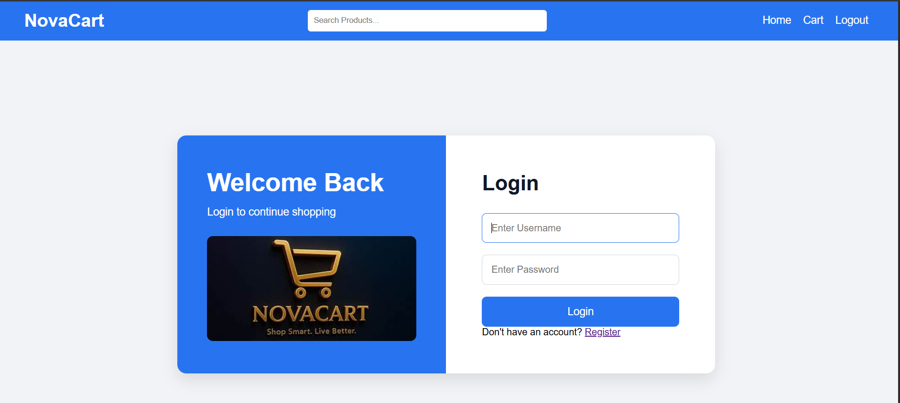
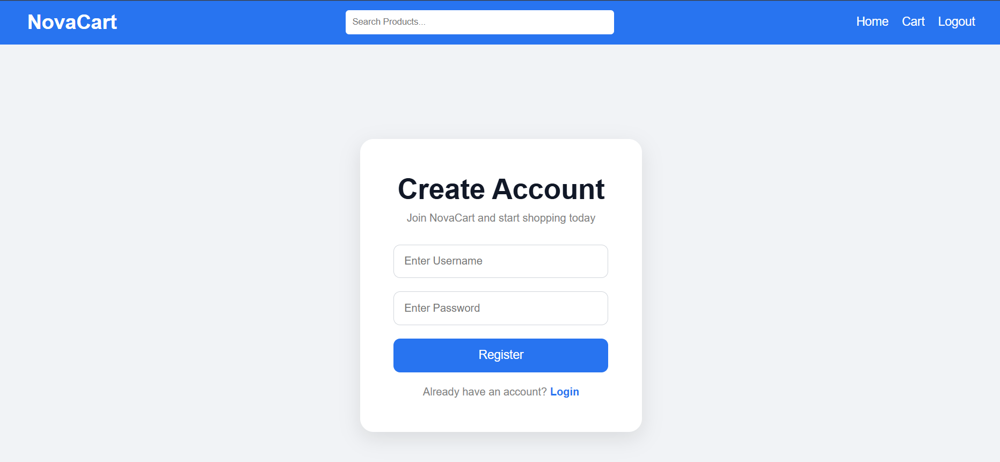
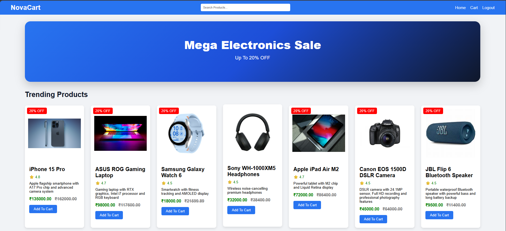
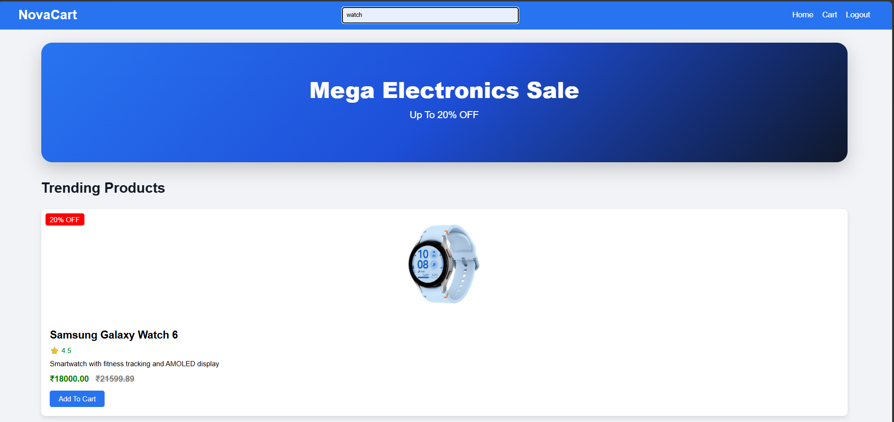
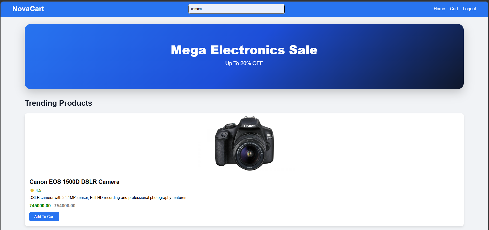
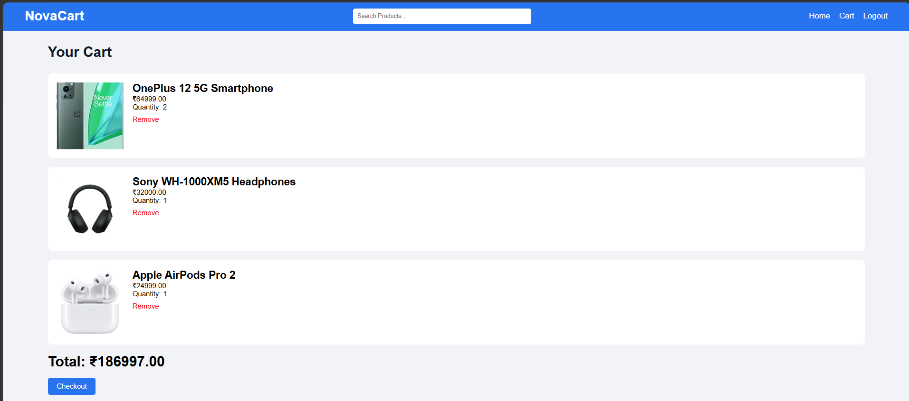
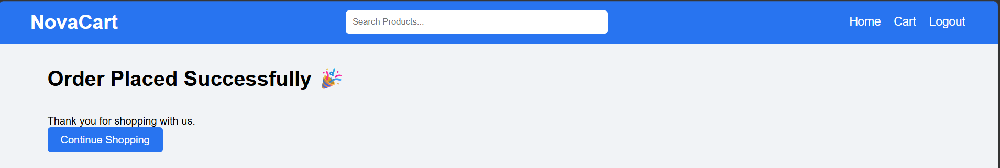

# 🛒 E-commerce Web Application (Django + MySQL)

A fully functional **E-commerce web application** built using Django framework and MySQL database. This project includes product listing, cart system, user authentication, and order management.

---

## 🚀 Features

- 👤 User Registration & Login
- 🛍️ Product Listing
- 🛒 Add to Cart System
- 📦 Order Management
- 🔐 Admin Panel (Django Admin)
- 🗄️ MySQL Database Integration
- 📱 Responsive UI

---

## 🛠️ Tech Stack

- Python (Django)
- MySQL
- HTML, CSS, Bootstrap
- JavaScript
- Git & GitHub

---

## 📸 Screenshots

###  Login Page

### Register Page

### Home Page

### Home Page

### Search watch

### Search Camera

### Cart Page

### Order Page

---

## 👨‍💻 Author

Sachin Kumar

### LinkedIn
[LinkedIn Profile](https://www.linkedin.com/in/sachin-kumar-362b53343/)

### GitHub
[GitHub](https://github.com/SACHIN197-creator)

---

